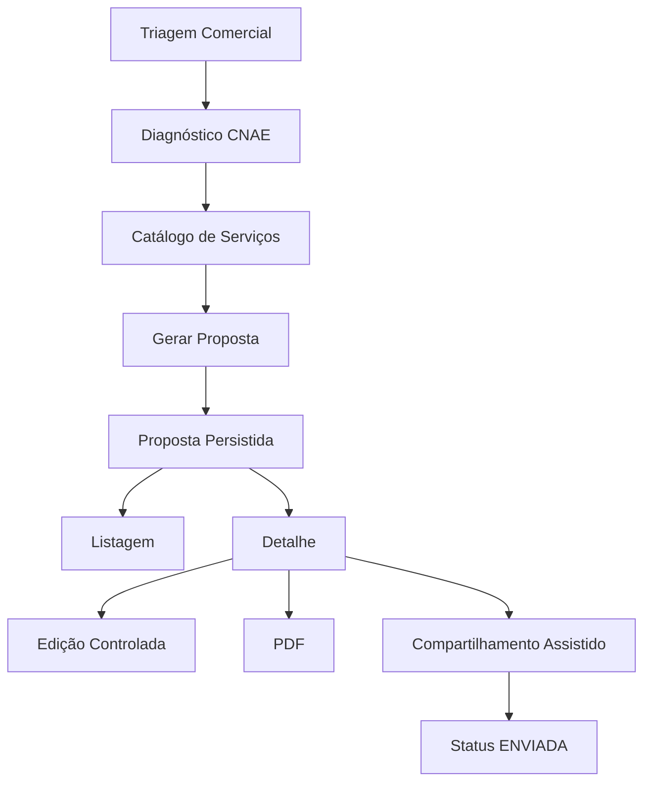

# 32. Relatório da Onda 2.12 — Fechamento do MVP Comercial e Auditoria Geral

## 1. Resumo Executivo

A Onda 2.12 consolidou formalmente o MVP Comercial sem adicionar novas funcionalidades.

Estado final auditado do MVP Comercial:

- triagem comercial autenticada;
- diagnóstico por CNAE;
- catálogo comercial autenticado;
- proposta comercial persistida;
- listagem de propostas;
- detalhe de proposta;
- edição controlada de status, validade e observações comerciais;
- geração de PDF autenticado;
- refinamento visual e validação manual do PDF;
- compartilhamento assistido por mensagem, link interno, WhatsApp Web e e-mail.

Escopo não executado nesta onda:

- contrato;
- ordem de serviço;
- financeiro;
- handoff operacional;
- aceite eletrônico;
- assinatura;
- cobrança;
- parcelas;
- migration;
- Prisma;
- seed;
- próxima onda.

## 2. Base de Auditoria

### 2.1. Relatórios lidos

- `docs/21_PLANO_ONDA_2_9_PROPOSTA_COMERCIAL_PERSISTIDA.md`
- `docs/22_RELATORIO_ONDA_2_9_1_MODELAGEM_PRISMA_PROPOSTA.md`
- `docs/23_RELATORIO_ONDA_2_9_2_API_PROPOSTA_COMERCIAL.md`
- `docs/24_RELATORIO_ONDA_2_9_2_1_SANEAMENTO_PRISMA_CLIENT.md`
- `docs/25_RELATORIO_ONDA_2_9_3_UI_PROPOSTA_COMERCIAL.md`
- `docs/26_RELATORIO_ONDA_2_9_4_TESTES_REFINAMENTO_UI_PROPOSTA.md`
- `docs/27_RELATORIO_ONDA_2_9_5_E2E_AUTENTICACAO_PROPOSTA.md`
- `docs/28_RELATORIO_ONDA_2_9_6_EDICAO_CONTROLADA_PROPOSTA_STATUS.md`
- `docs/29_RELATORIO_ONDA_2_10_PDF_PROPOSTA_COMERCIAL.md`
- `docs/30_RELATORIO_ONDA_2_10_1_REFINAMENTO_VALIDACAO_PDF_PROPOSTA.md`
- `docs/31_RELATORIO_ONDA_2_11_ENVIO_COMPARTILHAMENTO_PROPOSTA.md`

### 2.2. Arquivos auditados

Backend:

- `apps/api/src/modules/comercial/comercial.routes.ts`
- `apps/api/src/modules/comercial/catalogo.service.ts`
- `apps/api/src/modules/comercial/diagnostico.service.ts`
- `apps/api/src/modules/comercial/propostas.service.ts`
- `apps/api/src/modules/comercial/propostas.pdf.ts`
- `apps/api/src/modules/comercial/propostas.schemas.ts`
- `apps/api/src/modules/comercial/propostas.types.ts`
- `apps/api/src/modules/comercial/__tests__/diagnostico.routes.test.ts`
- `apps/api/src/modules/comercial/__tests__/propostas.routes.test.ts`

Frontend:

- `apps/web/src/app/(app)/comercial/triagem/page.tsx`
- `apps/web/src/app/(app)/comercial/triagem/triagem-form.tsx`
- `apps/web/src/app/(app)/comercial/triagem/actions.ts`
- `apps/web/src/app/(app)/comercial/propostas/page.tsx`
- `apps/web/src/app/(app)/comercial/propostas/[id]/page.tsx`
- `apps/web/src/app/(app)/comercial/propostas/actions.ts`
- `apps/web/src/app/(app)/comercial/propostas/shared.ts`
- `apps/web/src/app/api/comercial/propostas/[id]/pdf/route.ts`
- `apps/web/src/components/layout/app-sidebar.tsx`

Prisma auditado sem alteração:

- `apps/api/prisma/schema.prisma`
- `apps/api/prisma/migrations/20260512110000_add_proposta_comercial_persistida/migration.sql`
- `apps/api/prisma/seed/servicos-consultoria.ts`

## 3. Entregas Consolidadas do MVP Comercial

O MVP Comercial entregue até a 2.11 cobre:

- consulta autenticada ao catálogo comercial;
- diagnóstico comercial por CNAE usando o motor da Onda 2.7;
- geração de proposta comercial persistida a partir da triagem;
- persistência de `DiagnosticoComercial`, `PropostaComercial` e `ItemProposta`;
- listagem e detalhamento de propostas do tenant;
- edição controlada de `status`, `dataValidade` e `observacoesComerciais`;
- geração de PDF sanitizado no backend;
- download autenticado do PDF pela web;
- compartilhamento assistido da proposta;
- trilha de auditoria nas operações relevantes de proposta.

O MVP Comercial explicitamente ainda não cobre:

- contrato;
- aceite formal;
- assinatura eletrônica;
- ordem de serviço;
- financeiro;
- cobrança;
- parcelamento;
- handoff operacional;
- envio transacional de e-mail;
- API oficial do WhatsApp;
- link público externo da proposta.

## 4. Rotas Frontend Entregues

| Rota | Finalidade | Dados exibidos | Ações disponíveis | Endpoints consumidos | Limitações |
|---|---|---|---|---|---|
| `/comercial/triagem` | Executar triagem comercial a partir de CNAE e contexto mínimo | formulário de CNAE, UF, município, porte, situação, histórico regulatório; resultado com risco, enquadramento, orçamento, alertas, próximos passos e recomendações | `Executar triagem`; `Gerar proposta` após diagnóstico válido | `POST /api/v1/comercial/diagnostico/cnae`; `POST /api/v1/comercial/propostas` | não há envio real; sinais extras como `licencaVencida`, `possuiPgrs` e `possuiAutoInfracao` são contextuais da UI e não entram no payload do backend; não há acesso direto pelo menu lateral hoje |
| `/comercial/propostas` | Listar propostas comerciais persistidas do tenant | número, status, origem, lead, empresa, município/UF, totais, validade, criação, quantidade de itens, risco e CNAE principal | abrir detalhe em `Ver Detalhes` | `GET /api/v1/comercial/propostas` | a UI atual não expõe filtros de busca/status apesar de o backend suportar; listagem é tabela simples e usa o enum bruto em algumas colunas |
| `/comercial/propostas/[id]` | Consultar e operar uma proposta persistida | cabeçalho, status, origem, criação, validade, totais, dados comerciais, diagnóstico resumido, itens, observações comerciais e resumo para envio | voltar para listagem; salvar edição comercial; baixar PDF; copiar mensagem; copiar link interno; abrir WhatsApp Web; abrir e-mail; marcar como enviada quando permitido | `GET /api/v1/comercial/propostas/:id`; `PATCH /api/v1/comercial/propostas/:id`; `/api/comercial/propostas/:id/pdf` | não edita itens nem preços; botão de compartilhamento depende de APIs do navegador; WhatsApp e e-mail apenas abrem clientes locais; não existe aceite formal |

## 5. Endpoints Backend Entregues

### 5.1. Catálogo

| Endpoint | Finalidade | Autenticação | Dados retornados | Campos sensíveis protegidos | Status de teste |
|---|---|---|---|---|---|
| `GET /api/v1/comercial/catalogo` | listar catálogo comercial público autenticado | obrigatória | serviços ativos do catálogo com visão sanitizada e paginação | `custoInternoEstimado`, `margemLucroAlvo`, `valorReferenciaHora`, `metadata`, `atualizadoEm` | coberto indiretamente em `diagnostico.routes.test.ts` |
| `GET /api/v1/comercial/catalogo/:id` | consultar serviço específico do catálogo | obrigatória | detalhe do serviço; sanitizado por padrão e completo se `isAdmin` | mesmos campos protegidos na visão não administrativa | auditado, sem teste dedicado encontrado |
| `GET /api/v1/comercial/catalogo/admin` | listar catálogo administrativo completo | obrigatória | visão administrativa completa com paginação | não sanitiza porque é rota administrativa | auditado, sem teste dedicado encontrado; ver risco de perfil na seção 10 |

### 5.2. Diagnóstico

| Endpoint | Finalidade | Autenticação | Dados retornados | Campos sensíveis protegidos | Status de teste |
|---|---|---|---|---|---|
| `POST /api/v1/comercial/diagnostico/cnae` | gerar diagnóstico comercial preliminar por CNAE | obrigatória | CNAE principal, enquadramento, risco, obrigatoriedades, recomendações, orçamento, alertas e próximos passos | o diagnóstico público não expõe custo interno, margem, metadata nem snapshots | coberto por `diagnostico.routes.test.ts` com 5 testes |

### 5.3. Propostas

| Endpoint | Finalidade | Autenticação | Dados retornados | Campos sensíveis protegidos | Status de teste |
|---|---|---|---|---|---|
| `POST /api/v1/comercial/propostas` | criar proposta persistida a partir do diagnóstico | obrigatória e restrita a perfis comerciais | detalhe completo da proposta criada | não retorna `inputSnapshot`, `resultadoSnapshot`, `snapshotCatalogo`, `observacoesInternas`, `custoInternoEstimado`, `margemLucroAlvo`, `valorReferenciaHora`, `metadata` | coberto por `propostas.routes.test.ts` |
| `GET /api/v1/comercial/propostas` | listar propostas do tenant | obrigatória e restrita a perfis comerciais | coleção paginada de propostas resumidas | mesmas proteções do contrato público | coberto por `propostas.routes.test.ts` |
| `GET /api/v1/comercial/propostas/:id` | retornar detalhe de proposta do tenant | obrigatória e restrita a perfis comerciais | cabeçalho, dados comerciais, diagnóstico público, itens e autoria | mesmas proteções do contrato público | coberto por `propostas.routes.test.ts` e validado manualmente na Onda 2.9.5 |
| `PATCH /api/v1/comercial/propostas/:id` | atualizar status, validade e observações comerciais | obrigatória e restrita a perfis comerciais | detalhe público atualizado | mesmas proteções do contrato público | coberto por `propostas.routes.test.ts` |
| `GET /api/v1/comercial/propostas/:id/pdf` | gerar e baixar PDF da proposta | obrigatória e restrita a perfis comerciais | binário PDF com nome seguro baseado no número da proposta | PDF é gerado exclusivamente do contrato público sanitizado | coberto por `propostas.routes.test.ts` e validado manualmente na Onda 2.10.1 |

## 6. Fluxo Ponta a Ponta do MVP Comercial

### 6.1. Fluxo funcional

1. usuário autenticado acessa `Triagem Comercial`;
2. informa CNAE e contexto mínimo;
3. frontend chama `POST /api/v1/comercial/diagnostico/cnae`;
4. backend usa `DiagnosticoService` para gerar risco, enquadramento, recomendações e estimativa;
5. usuário aciona `Gerar proposta`;
6. frontend chama `POST /api/v1/comercial/propostas`;
7. backend recalcula o diagnóstico, valida itens, persiste diagnóstico, proposta e itens;
8. proposta passa a aparecer em `/comercial/propostas`;
9. usuário abre `/comercial/propostas/[id]`;
10. usuário pode editar `status`, `dataValidade` e `observacoesComerciais`;
11. usuário pode baixar o PDF autenticado;
12. usuário pode copiar mensagem, copiar link interno, abrir WhatsApp Web ou e-mail;
13. usuário pode marcar a proposta como `ENVIADA` quando a transição for válida.

### 6.2. Fluxo Mermaid

## 7. Segurança Consolidada

### 7.1. Controles confirmados

- autenticação obrigatória no módulo comercial via hook `authenticate`;
- segregação multi-tenant em consultas de proposta;
- bloqueio por perfis comerciais no service de propostas;
- contrato público sanitizado para listagem e detalhe;
- PDF gerado apenas do contrato público;
- proteção de rotas frontend sem sessão, com redirecionamento para `/login`;
- auditoria de criação e atualização de proposta.

### 7.2. Campos sensíveis protegidos

Foi confirmada a não exposição de:

- `inputSnapshot`
- `resultadoSnapshot`
- `snapshotCatalogo`
- `observacoesInternas`
- `custoInternoEstimado`
- `margemLucroAlvo`
- `valorReferenciaHora`
- `metadata`

### 7.3. Observação sobre o seed

O seed do catálogo comercial continua contendo campos internos como `valorReferenciaHora`, `custoInterno` e `margem`, o que é esperado no backend e necessário ao catálogo. A proteção ocorre na camada de resposta pública, não no seed.

## 8. Prisma, Migration e Seed

### 8.1. Prisma

O schema contém as entidades comerciais planejadas:

- `DiagnosticoComercial`
- `PropostaComercial`
- `ItemProposta`

Também contém os enums comerciais necessários:

- `StatusPropostaComercial`
- `OrigemPropostaComercial`
- demais enums de porte, situação, risco, potencial poluidor e decisão de item.

### 8.2. Migration auditada

Migration comercial auditada:

- `apps/api/prisma/migrations/20260512110000_add_proposta_comercial_persistida/migration.sql`

Conteúdo confirmado:

- criação dos enums comerciais;
- criação de `diagnosticos_comerciais`;
- criação de `propostas_comerciais`;
- criação de `itens_proposta`;
- índices por tenant e status;
- relação com `LeadWhatsApp`, `Empreendimento`, `Usuario` e catálogo.

### 8.3. Seed auditado

Seed de catálogo auditado:

- `apps/api/prisma/seed/servicos-consultoria.ts`

Conclusão:

- o seed comercial existe e segue sendo a base do catálogo;
- não houve alteração de seed na trilha 2.9 a 2.12;
- o MVP Comercial depende desse catálogo para recomendação, criação de itens e faixas de preço.

## 9. Validações Executadas

### 9.1. Validações históricas relevantes

- Onda 2.9.5: autenticação real, proteção de rotas e validação visual do detalhe;
- Onda 2.10.1: geração real de PDF, validação manual de conteúdo e layout;
- Ondas 2.9.2, 2.9.6, 2.10 e 2.11: cobertura automatizada da API comercial.

### 9.2. Validação técnica final executada na Onda 2.12

| Comando | Resultado |
|---|---|
| `npm run typecheck` em `apps/api` | Passou |
| `npm run build` em `apps/api` | Passou |
| `npm test` em `apps/api` | Passou |
| `npm run build` em `apps/web` | Passou |
| `npm run typecheck` em `apps/web` antes do build | Falhou por `.next/types` stale |
| `npm run typecheck` em `apps/web` após o build | Passou |

Resultado final da suíte da API:

- `2` arquivos de teste passados
- `14` testes passados

Observação operacional:

- `npm test` em `apps/api` falha no sandbox por bloqueio de acesso ao Redis local;
- a rerodagem com permissão expandida confirmou a suíte real passando.

## 10. Limitações Atuais do MVP

- a criação de proposta pela triagem usa apenas o payload do diagnóstico, sem preenchimento comercial avançado de contato na UI;
- a listagem de propostas não expõe filtros, paginação visual ou busca na interface, embora o backend suporte;
- a edição da proposta não permite alterar itens, quantidades ou preços;
- o compartilhamento é assistido apenas por cliente local, sem envio transacional;
- o PDF continua preliminar e não substitui contrato;
- não existe link público externo da proposta;
- não existe jornada de aceite/aprovação formal do cliente;
- a rota `/comercial/triagem` não está exposta no menu lateral atual;
- o módulo ainda depende de raw SQL no backend de propostas por pendência do Prisma Client.

## 11. Pendências Técnicas

### 11.1. Pendência principal

Persistência de propostas ainda usa `$queryRaw` e `$executeRaw` em `propostas.service.ts`, porque o Prisma Client do workspace segue stale e não expõe delegates confiáveis para:

- `diagnosticoComercial`
- `propostaComercial`
- `itemProposta`

### 11.2. Pendência de alinhamento de perfis

Na rota `GET /api/v1/comercial/catalogo/admin`, a checagem atual exige `request.user.perfil === 'ADMIN'`, enquanto o restante do módulo comercial e do app usa perfis como:

- `ADMIN_TENANT`
- `SUPER_ADMIN`
- `EXECUTIVO`
- `COORDENADOR`

Conclusão:

- a rota existe, mas há risco de desalinhamento de autorização com os perfis reais do sistema;
- não foi corrigida nesta onda por restrição explícita de não criar nova funcionalidade.

### 11.3. Pendência de robustez do web typecheck

O `tsconfig` do web inclui `.next/types/**/*.ts`, então o `typecheck` pode falhar quando os artefatos de build estão stale. O estado final da aplicação é válido após `next build`, mas a ergonomia local continua frágil.

## 12. Riscos Consolidados

| Risco | Impacto | Situação atual |
|---|---|---|
| Prisma Client stale no módulo de propostas | manutenção mais custosa e risco maior em evoluções do domínio comercial | conhecido, documentado e não bloqueou o MVP |
| rota administrativa do catálogo com perfil potencialmente incorreto | acesso administrativo inconsistente ao catálogo completo | auditado e pendente de alinhamento |
| ausência de aceite formal | proposta pode ser enviada, mas não há trilha formal de concordância do cliente | intencionalmente fora do escopo do MVP |
| ausência de link público externo | compartilhamento depende de usuário autenticado ou de canais paralelos | intencionalmente fora do escopo do MVP |
| UI da listagem sem filtros visuais | operação comercial pode perder eficiência com volume de propostas | não bloqueia o MVP, mas reduz escalabilidade operacional |

## 13. Decisão sobre Entrada na Onda 3

Decisão recomendada:

**MVP Comercial aprovado para entrada na Onda 3, com ressalvas não bloqueantes.**

Justificativa:

- o fluxo principal ponta a ponta existe e foi validado;
- há persistência real de proposta com segurança adequada;
- a UI cobre triagem, geração, listagem, detalhe, edição básica, PDF e compartilhamento assistido;
- a API comercial possui cobertura automatizada relevante;
- o PDF foi validado manualmente;
- a autenticação e a proteção de rotas foram validadas em ambiente real.

Ressalvas que devem permanecer visíveis para o planejamento da Onda 3:

- resolver o saneamento do Prisma Client continua sendo a principal dívida técnica;
- alinhar a autorização de `catalogo/admin` é recomendável antes de expandir o uso administrativo do catálogo;
- caso a Onda 3 exija escala operacional maior, filtros visuais e busca na listagem passam a ter prioridade.

## 14. Status Final

O MVP Comercial está formalmente fechado com:

- escopo funcional mínimo entregue;
- proteção de dados sensíveis mantida;
- auditoria documental consolidada;
- validação técnica final executada;
- recomendação positiva para avanço controlado à Onda 3.
