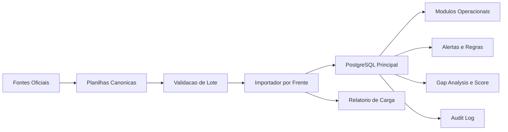

# 100. Arquitetura de Execucao do Fomento

Data: 2026-06-11

## 1. Objetivo

Definir como a base normativa e operacional sera consolidada no sistema sem criar um segundo banco principal e sem depender de cadastro manual caotico.

## 2. Principio central

Arquitetura recomendada:

`fonte oficial -> planilha canonica -> validacao -> importacao por lote -> auditoria -> automacao`

O banco principal continua sendo o mesmo `PostgreSQL`. O que muda e a esteira de entrada, validacao e revisao dos dados.

## 3. Camadas da arquitetura

### Camada 1 - Fontes oficiais

Origem do dado:

- leis, decretos, portarias, resolucoes e normas tecnicas;
- licencas reais, condicionantes e processos reais;
- documentos do cliente;
- laudos e certificados de terceiros;
- formularios e evidencias de campo.

### Camada 2 - Base canonica de implantacao

Representada por planilhas controladas.

Pacote entregue neste diretorio:

- `templates_csv/00_controle_carga.csv`
- `templates_csv/01_orgaos_reguladores.csv`
- `templates_csv/02_tipos_documento.csv`
- `templates_csv/03_tipos_processo.csv`
- `templates_csv/04_fases_tipo_processo.csv`
- `templates_csv/05_requisitos_tipo_processo.csv`
- `templates_csv/06_obrigacoes_regulatorias.csv`
- `templates_csv/07_limites_parametros.csv`
- `templates_csv/08_usuarios.csv`
- `templates_csv/09_empreendimentos.csv`
- `templates_csv/10_acessos_empreendimento.csv`
- `templates_csv/11_processos_documentos.csv`
- `templates_csv/12_licencas_alvaras_condicionantes.csv`
- `templates_csv/13_sst.csv`
- `templates_csv/14_equipamentos_residuos.csv`
- `templates_csv/15_outorga_monitoramento.csv`
- `templates_csv/16_BACKLOG_ORQUESTRACAO.csv`
- `templates_csv/17_fontes_oficiais.csv`

### Camada 3 - Validacao de lote

Cada lote deve passar por:

1. validacao de formato;
2. validacao de chave de negocio;
3. validacao de dependencia;
4. validacao funcional;
5. validacao de duplicidade;
6. validacao de dominio.
7. validacao de vigencia da fonte.
8. validacao de autenticidade documental.

Exemplos:

- `tenant_slug` precisa existir;
- `empresa_cnpj` precisa existir antes do empreendimento;
- `orgao_sigla` precisa existir antes do tipo de processo;
- `tipo_documento_codigo` precisa existir antes do requisito;
- `empreendimento_codigo` precisa existir antes de processo, licenca, SST, tanque, poco etc.
- toda regra normativa precisa apontar para `source_id` vigente e revisado.
- documento `NAO_CONFIRMADO` nao pode entrar como base oficial.

### Camada 4 - Importacao controlada

Padrao recomendado para os importadores:

- entrada: CSV;
- transformacao: normalizacao de campos e referencias;
- escrita: `upsert` por chave de negocio;
- saida: relatorio de `criados`, `atualizados`, `ignorados`, `erros`;
- trilha: auditoria por lote.

### Camada 5 - Banco transacional

Destino final: os modelos ja existentes no schema Prisma.

Grupos principais:

- catalogos mestres;
- empreendimentos e acessos;
- processos e documentos;
- licencas e condicionantes;
- SST;
- equipamentos;
- residuos;
- agua e monitoramento.

### Camada 6 - Consumo operacional

Depois da carga, os dados alimentam:

- gap analysis;
- vencimentos;
- regras automaticas;
- checklists;
- score de compliance;
- portal;
- app de campo;
- relatorios e backlog operacional.

## 4. Fluxo logico

## 5. Chaves de negocio

Nao usar IDs internos nas planilhas como referencia primaria de trabalho. Usar chaves humanas e estaveis.

Padrao recomendado:

- tenant: `tenant_slug`
- empresa: `empresa_cnpj`
- usuario: `usuario_email`
- empreendimento: `empreendimento_codigo`
- orgao: `orgao_sigla + estado_uf + municipio`
- tipo documento: `tipo_documento_codigo`
- tipo processo: `orgao_sigla + nome`
- processo: `numero_protocolo` ou combinacao controlada
- licenca: `empreendimento_codigo + numero`
- alvara: `empreendimento_codigo + tipo + numero`
- bomba: `empreendimento_codigo + numero`
- tanque: `empreendimento_codigo + numero`
- poco artesiano: `empreendimento_codigo + codigo`
- poco monitoramento: `empreendimento_codigo + codigo`

## 6. Ordem de carga

Ordem recomendada:

1. `00` controle do lote
2. `01` orgaos
3. `02` tipos de documento
4. `03` tipos de processo
5. `04` fases
6. `05` requisitos
7. `06` obrigacoes regulatorias
8. `07` limites de parametros
9. `08` usuarios
10. `09` empreendimentos
11. `10` acessos por empreendimento
12. `11` processos e documentos
13. `12` licencas, alvaras e condicionantes
14. `13` SST
15. `14` equipamentos e residuos
16. `15` outorga e monitoramento

## 7. Modulos de importacao recomendados

Mesmo sem codificar agora, a arquitetura recomendada pede um modulo `importacoes` com:

- `POST /api/v1/importacoes/validar`
- `POST /api/v1/importacoes/executar`
- `GET /api/v1/importacoes/:loteId`
- `GET /api/v1/importacoes/:loteId/erros`

E com pelo menos estas frentes:

- catalogos;
- empreendimentos;
- processos-documentos;
- licencas-condicionantes;
- sst;
- equipamentos-residuos;
- outorga-monitoramento.

## 8. Estrutura de governanca

Cada lote deve ter:

- responsavel funcional;
- responsavel de dados;
- responsavel tecnico pela carga;
- aprovador final.

RACI minimo:

- funcional: valida conteudo;
- dados: preenche e saneia planilha;
- tecnico: importa e corrige erro estrutural;
- coordenacao: aprova lote para uso operacional.

## 9. Criterio de pronto

Um lote so esta concluido quando:

1. passou na validacao estrutural;
2. passou na validacao funcional;
3. entrou no banco sem erro bloqueante;
4. esta visivel no modulo correspondente;
5. gerou rastreabilidade de auditoria;
6. o time confirmou amostra real no sistema.
